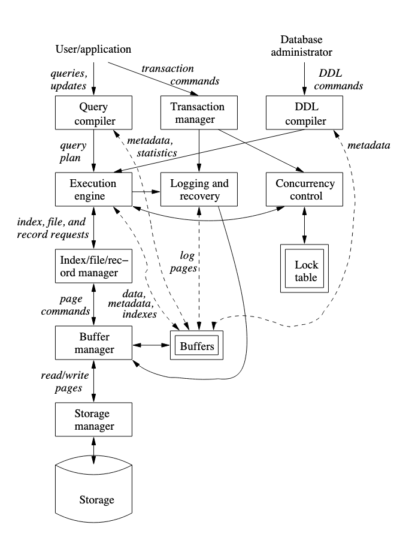

# Teórica - 17/08

Se definió el concepto de **DER** (**D**iagramas **E**ntidad **R**elación) describe la interrelación interrelated de cosas de interés dentro del alcance del dominio de un problema.

Algunos conceptos a utilizar

- Entidad: Objeto relevante para el sistema. Tiene sentido tenerla cuando tiene características propias. Se representa con un cuadrado
- Atributo: Cualquier característica relevante de la entidad propia. Se representa con un círculo
  - Atributo simple: Atributo sin características especiales
  - Atributo identificatorio: Identificar una instancia unívocamente
  - Atributo compuesto: Aquel que se puede dividir
  - Atributo multivariado: Cuando podria ser mas de uno
- Interrelaciones: Vínculo entre dos entidades. Se representa con un rombo. Contiene varios aspectos:
  - Interrelaciones identificatorias.
  - Cardinalidad: tiene que ser una relación ACTUAL. Explica la cantidad de relaciones que se pueden dar
    - 1-1
    - 1-n
    - n-m
 - Participación:
    - Parcial: Si existe alguno que puede no cumplir la relación
    - Completa: Si todos cumplen con la relación
- Relaciones ternarias: Se necesitan las 3 identidades al mismo tiempo para que la relación funcione. Es bastante útil pero aparece muy poco
- Agregación: Vincular una interrelación con una identidad. Además esta vinculación tiene que ser temporalmente posterior con respecto a la interrelación. Se denota con un rectángulo conteniendo a la interrelación y sus entidades vinculadas

Pongo un resúmen del primer capítulo de *Database Systems:
The Complete Book* y del capítulo 2 del *Principles of Database and
Knowledge Base Systems*

## Database Systems: The Complete Book

- Sucintamente, una base de datos es una colección de información que
  se mantiene por un período de tiempo (por lo general largo).
- Es una colección de datos que es manejada por un DBMS. Este tiene
  que permitir y/o asegurar:
  1. **crear** nuevas bases de datos y **especificar** sus **schemas**
  2. hacer **consultas y modificaciones** sobre los datos con un *query language* o *data-manipulation language*
  3. almacenar grandes cantidades de información con acceso eficiente para las operaciones de **2**
  4. **persistencia/durabilidad** de la información: o sea que se pueda recuperar la data ante fallas
  5. **Aislamiento** y **Atomicidad** de operaciones (o transacciones como se ve más adelante)

... (Un poco de historia)

### Overview de un DBMS

Hay 2 tipos de usuarios de la base de datos:

- Usuarios y aplicaciones
- El administrador de la base de datos

Los comandos que uno y otro ejecutan toman distintos flujos dentro del
dbms aunque comparten subsistemas en común.

### Data-Definition Language Commands

El administrador usa un *DDL* (Data Definition Language) para definir
la estructura y constraints de las tablas. Estas instrucciones las
parsea un procesdor de DDLs y se envían el *execution engine*, y hacia
los index/file/record managers.

### Procesamiento de Queries

El usuario en cambio usa un *DML* (Data Manipulation Language) para
armar consultas que modifican o extraen información de la base de
datos. Estas consultas las atienden dos subsistemas:

- **Query**: El primer subsistema consiste en el *query compiler +
  execution engine + buffer manger*, y se encarga de la respuesta en
  sí de la query.
- **Transacciones**: Las transacciones son operaciones que se tienen
  que realizar de forma atómica y aisladas unas de otras (da lo mismo
  si ejecutan al mismo tiempo que si no), y a su vez estas tienen que
  poder ser persistidas. El subsistema que se encarga de procesar
  transacciones entonces está compuesto por:
  - Un *scheduler*, para garantizar atomicidad y aislamiento
  - Un *logging & recovery manager* para la persistencia de las
    transacciones

### Manejo de almacenamiento y buffers

A esto lo componen dos piezas:

- El *storage manager*, que sirve de interfaz entre el disco y el resto del DBMS
- El *buffer manager*, que maneja la memoria principal (RAM) organizándola en buffers en los que se cargan:
  - Data
  - Metadata
  - Log Records
  - Estadísticas
  - Índices

### Procesamiento de transacciones

El subsistema que procesa transacciones se encarga de 3 tareas:

1. **logging**, en el que se escribe un log en disco cada cambio en la
   base de datos. Esto sirve para garantizar persistencia de las
   transacciones. El *log manager* usa alguna política para que en
   conjunto con el *recovery manager* se pueda restaurar la DB a un
   estado consistente en caso de fallas.
2. **concurrency control**, manejado por el *schedular* que mantiene
   locks sobre los recursos.
3. **deadlock resolution**. De esto se encarga el *transaction
   manager*, cancelando algunas transacciones hasta que se liberan los
   recursos necesarios como para continuar con la ejecución.

**Propiedades ACID:**

- A de *atomicity* de la ejecución de transacciones.
- I de *isolation* ya que las transacciones se tienen que ejecutar
  como si ninguna otra se haya ejecutado en el medio
- D de *durability* ya que las transacciones no deben perderse
- C de *consistencia* (ojo, con el surgimiento de bases de datos
  distribuidas/sistemas distribuidos, se fue transicionando a otros
  esquemas en donde no necesariamente se garantiza consistencia si no
  algo un poco más débil. Para más info buscar sobre **CAP theorem**)

### Query Processor

Al *query processor* lo componen dos partes:

1. El *query compiler*, que consiste de un parser, preprocessor y un
   optimizer para las queries y genera un **query plan**.
2. El *execution engine* al que le llegan los query plans y tiene que
   llevarlos a cabo.

## Principles of Database and Knowledge Base Systems (ch. 2)
